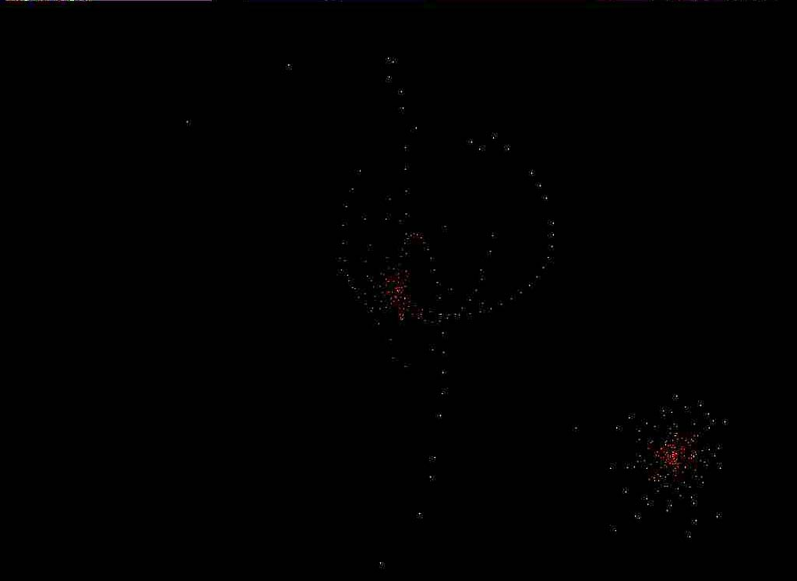



## Time Machine

### Description

First Time Machine is Created by Kaveh Abdollahi.

i am very tired.

i can't fully Explane about it Now.

To enter the fourth dimension we need To Translate Natural Numbers to Prime Numbers

1=2 2=3 3=5 4=7 5=11 6=13 7=17 8=19 9=23 10=29 ...

but We only need The distance between primes Numbers For Example:

1 2 2 4 2 4 2 4 6 .......

its a password To login Into Time Dimension.

This is the only key for 4D view

if you can understand it , then you understand :

Quantum mechanics -- is false.

Relativity theory E=MC2 -- Is Always true in any place and any time.

String theory -- is True .

Chaos theory -- is True

UNIVERSE Doesn't Need BIG BANG

and more .....

this code doesn't have copyright. its free for All People on the world.
 
### More Info
 

             |
---                |---
**Submitted On**   |2010-01-23 23:38:58
**By**             |[Kaveh Abdollahi](https://github.com/Planet-Source-Code/PSCIndex/blob/master/ByAuthor/kaveh-abdollahi.md)
**Level**          |Intermediate
**User Rating**    |5.0 (20 globes from 4 users)
**Compatibility**  |VB 5\.0, VB 6\.0
**Category**       |[Math/ Dates](https://github.com/Planet-Source-Code/PSCIndex/blob/master/ByCategory/math-dates__1-37.md)
**World**          |[Visual Basic](https://github.com/Planet-Source-Code/PSCIndex/blob/master/ByWorld/visual-basic.md)
**Archive File**   |[Time\_Machi2173401232010\.zip](https://github.com/Planet-Source-Code/kaveh-abdollahi-time-machine__1-72859/archive/master.zip)

